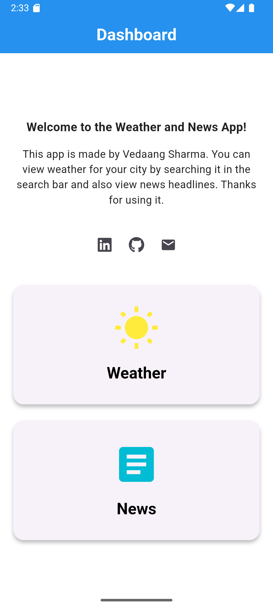
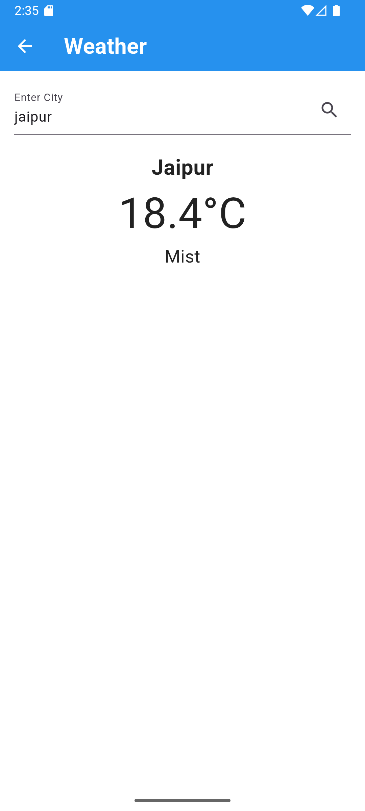

# Weather and News App

[](https://flutter.dev/)

A simple and elegant Flutter application that provides you with the latest weather updates and news headlines in one place.

## Features

*   **Real-time Weather:** Get the current weather conditions for any city.
*   **City Search:** Easily search for and save your desired city.
*   **Top News Headlines:** Stay informed with the latest news from around the world.
*   **Simple & Clean UI:** A user-friendly interface for a seamless experience.

## Screenshots

| Home Screen | Weather Screen | News Screen |
| :---: | :---: | :---: |
|  |  |  |

## Download

[Download the latest APK build here.](https://github.com/gtathelegend/Weather-and-News-App-Flutter/releases/tag/v1.0.2)

## Getting Started

To get a local copy up and running, follow these simple steps.

### Prerequisites

*   Flutter SDK: [https://flutter.dev/docs/get-started/install](https://flutter.dev/docs/get-started/install)

### Installation

1.  Clone the repo:
    ```sh
    git clone https://github.com/your_username/your_repository.git
    ```
2.  Install packages:
    ```sh
    flutter pub get
    ```
3.  Run the app:
    ```sh
    flutter run
    ```

## Built With

*   [Flutter](https://flutter.dev/) - The UI toolkit for building natively compiled applications for mobile, web, and desktop from a single codebase.
*   [http](https://pub.dev/packages/http) - For making HTTP requests to fetch weather and news data.
*   [url_launcher](https://pub.dev/packages/url_launcher) - For launching URLs to external websites and mail clients.
*   [font_awesome_flutter](https://pub.dev/packages/font_awesome_flutter) - For the social media icons.

## Contact

Vedaang Sharma

*   [LinkedIn](https://linkedin.com/in/vedaangsharma2006)
*   [GitHub](https://github.com/gtathelegend)
*   [Email](mailto:vedaangsharma2006@gmail.com)
